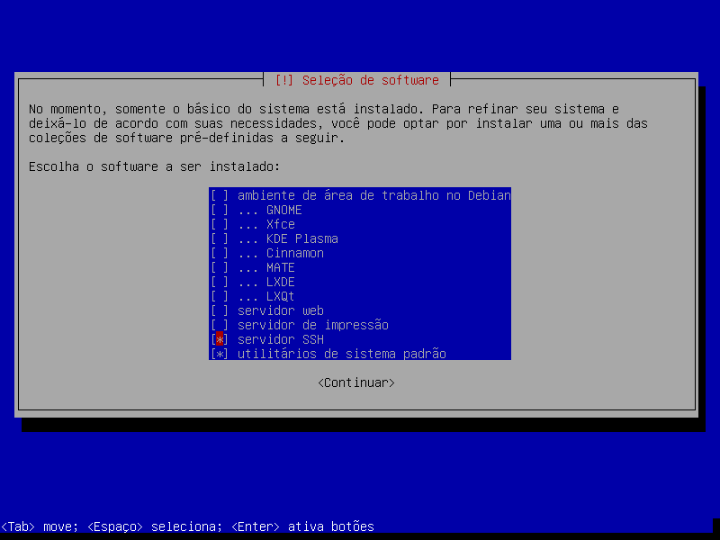

# Scripts de pós-instalação do Debian.

Estes scripts são os que eu utilizo para novas instalações do Debian nas **minhas** máquinas -- use por sua conta e risco.

[[_TOC_]]


## 1 - Recomendações importantes

Se você quiser se arriscar a executar esse script na sua instalação, fique muito atento às recomendações abaixo.

### 1.1 - Instalação mínima do Debian stable/unstable

Esse script foi pensado para ser executado logo após uma instalação mínima da imagem netinstall do Debian [stable](https://cdimage.debian.org/images/unofficial/non-free/images-including-firmware/current/amd64/iso-cd/) ou [testing](https://cdimage.debian.org/cdimage/unofficial/non-free/cd-including-firmware/daily-builds/sid_d-i/current/amd64/iso-cd/) com firmware non-free. "Minima", no nosso caso, quer dizer apenas "sem nenhum ambiente gráfico", selecionando apenas com os **utilitários padrão do sistema** e o **servidor SSH** nas opções de software a serem instalados (tasksel).



> Todo o procedimento de instalação é detalhadamente descrito neste vídeo: https://youtu.be/V98FeIb4Yvg

> **Importante!** O Debian não tem uma imagem de instalação do Sid/unstable! Para instalá-lo, você deve utilizar a imagem de instalação do *testing* e alterar o arquivo `/etc/apt/sources.list`.

Não se esqueça de editar suas fontes de repositórios (`sudo apt edit-sources`) e atualizar o sistema (`sudo apt update`) antes de prosseguir.

### 1.2 - Atenção aos repositórios `contrib` e `non-free`

Eles não são obrigatórios, mas alguns pacotes incluídos nas listas fornecidas por padrão só existem nesses repositórios. Portanto, se quiser instalá-los, você deverá editar e atualizar suas fontes de repositórios antes de executar este script.

### 1.3 - Instalando via wi-fi

Infelizmente, com essa instalação mínima, o Debian não fornece nenhum programa amigável para conexão com redes wifi pela linha de comando. Por isso, quando eu uso esses scripts sem uma rede cabeada, meu procedimento de conexão pela linha de comando é o seguinte:

#### Criar o arquivo `wpa_supplicant.conf`:

$ sudo nano /etc/wpa_supplicant.conf

No arquivo aberto, incluir o nome da rede (`ssid`) e a senha (`psk`) da seguinte forma:

```
network={
         ssid="NOME_DA_SUA_REDE"
         psk="SENHA"
}
```

Salvar e sair do `nano`.

#### Detectando a interface de rede wifi

Executar o comando `ip a`.

Para efeitos de exemplo, digamos que a interface identificada tenha sido `wlp2s0`.

#### Ativando a rede wifi

Executar estes comandos em sequência:

```
$ sudo ip link set wlp2s0 down
$ sudo ip link set wlp2s0 up
$ sudo wpa_supplicant -B -i wlp2s0 -c /etc/wpa_supplicant.conf -Dnl80211,wext
$ sudo dhclient wlp2s0
```

Com isso, a conexão wifi já deve estar funcionando.


#### Se precisar reiniciar antes de ter um ambiante gráfico

Basta executar novamente:

```
$ sudo wpa_supplicant -B -i wlp2s0 -c /etc/wpa_supplicant.conf -Dnl80211,wext
$ sudo dhclient wlp2s0
```

## 2 - Como clonar e executar

Após a instalação, a conexão com a rede e a edição/atualização dos repositórios, o primeiro passo é instalar o `git`:

```
$ sudo apt install git
```

Com o `git` instalado, podemos clonar este repositório:

```
$ git clone https://gitlab.com/blau_araujo/debian-scripts.git
```

Ao final da clonagem, entre na pasta `debian-scripts` e execute `./pinstall.sh` para iniciar os procedimentos.


## 3 - Utilização recomendada

  1. Forque o repositório para a sua conta do GitLab;
  2. Modifique as listas de pacotes conforme a sua necessidade;
  3. Ao clonar na sua instalação, clone o **seu repositório** no GitLab;
  4. Teste e administre os seus repositórios com as suas mudanças.

